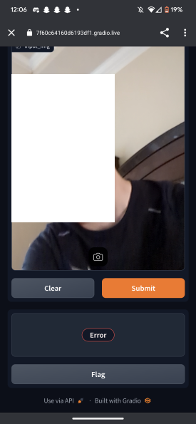

sadly the code to this is on a USB drive at my house which I am not at at this point when i am updating my github

and the only screenshot i can find is of it not working :sobs: (it worked like 30 seconds after this was taken tho, this person was a 6)

